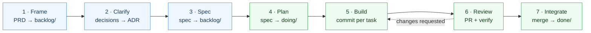

# lean-sdd-kit

**A lean, agent-native template for Spec-Driven Development.**
Start a new project fast, build autonomously, and keep everything documented — with status tracked by *where a document lives*, not by a tool.

[](./LICENSE)
[](./WORKFLOW.md)

---

## What is this?

`lean-sdd-kit` is a **copy-and-go repository skeleton** for building software with an AI coding agent (Claude Code, Cursor, Copilot, …) as a first-class collaborator. It gives you a handful of documented artifacts and one rule:

> **The directory a document lives in *is* its status.** `backlog/ → doing/ → done/`. Move it with `git mv`. No status field, nothing to keep in sync.

It is intentionally minimal — designed for **1–3 person teams** and **monorepos** — and stack-agnostic. There is no CLI to install and no runtime dependency: it is Markdown, a couple of optional shell helpers, and a workflow.

## Why this method?

"Vibe coding" — prompting an agent and hoping — breaks down the moment a task is non-trivial. The agent loses intent, contradicts earlier decisions, and you can't tell what's done. **Spec-Driven Development (SDD)** fixes this by making *intent* the durable artifact: you write down the *why* and *what* before the *how*, and the agent executes against a spec it can't drift away from.

This kit takes the parts of SDD that pay off for a small team and drops the ceremony:

| Principle | Why it matters |
|---|---|
| **Intent is written before code** | The agent has a contract to satisfy → 3–10× higher first-pass success on real tasks. |
| **Specs persist (they're not throwaway)** | When code and spec live together, the next change — by you or the agent — starts from truth, not archaeology. |
| **Status = directory** | A 3-person team should see all work-in-progress with one `ls`, not a Jira board. |
| **Specs are agent-executable** | Each spec ends in *tasks → acceptance criteria → verification commands*, so an agent can build and self-check. |
| **Decisions are an append-only log (ADRs)** | You never wonder "why did we choose X?" six weeks later. |

See [`WORKFLOW.md`](./WORKFLOW.md) for the full loop and how it compares to spec-kit, Kiro, BMAD, OpenSpec and Tessl.

## The documents

Three **work documents** that flow through states, and two **living documents** that don't:

| Doc | Question it answers | Lives in | Flows through states? |
|---|---|---|---|
| **PRD** | *Why* and *what* — the intent of an initiative | `docs/prds/<state>/` | ✅ yes |
| **Spec** | *How* — the agent-executable plan of work | `docs/specs/<state>/` | ✅ yes |
| **ADR** | *Why we chose X* — an architectural decision | `docs/adr/` | ❌ append-only log |
| **CLAUDE.md** | The standing rules of the repo (principles, conventions, Definition of Done) | repo root | n/a (living) |
| **STACK.md** | The toolset: languages, package map, build/test/lint/run commands | repo root | n/a (living) |

> A small feature can be **just a spec** (its header carries the lightweight "why"). A larger initiative gets a **PRD + one or more specs**.
>
> 👀 See a filled-in PRD + spec in [`docs/examples/`](./docs/examples).

## The workflow at a glance

Each box is a phase; the small line under it is the document/git artifact it produces. Blue = THINK (cheap to change), green = BUILD (expensive to change).



Full version, with every document-creation and git event, in [`WORKFLOW.md`](./WORKFLOW.md).

## Quickstart — start a new project

**Get the skeleton** — pick either method (both work, they're equivalent):

- **A. "Use this template" button** (no terminal): click *Use this template → Create a new repository* at the top of [the GitHub repo](https://github.com/RuBiCK/lean-sdd-kit). You get a fresh repo with these files and a clean history.
- **B. `npx degit`** (terminal, no history): `npx degit RuBiCK/lean-sdd-kit my-project` — downloads just the files, no `.git`, ready to `git init`.

Then **set it up** — two equivalent paths:

**Agentic (Claude Code).** Open your agent in the new repo and say:

> *"Run `sdd-setup`."*

The `sdd-setup` skill interviews you for your toolset (writes [`STACK.md`](./STACK.md)), drafts your `PRD-0001` charter and `CLAUDE.md` Principles, and records your stack as an ADR. Then write your first slice of work — *"Run `sdd-new spec bootstrap-app`"* — and build it — *"Run `sdd-build`"*. No commands to memorize.

**Manual (any editor).**

```bash
cd my-project   # method B only; method A already cloned your new repo

# 1. Fill the toolset
$EDITOR STACK.md            # languages, package manager, package map, commands

# 2. Write your project charter (PRD-0001) and make the rules yours
./scripts/new.sh prd project-charter
mv docs/prds/backlog/0001-project-charter.md docs/prds/doing/   # brand-new file → plain mv
$EDITOR docs/prds/doing/0001-project-charter.md
$EDITOR CLAUDE.md           # fill the Principles + project one-liner

# 3. Record the stack decision, then write the first spec
./scripts/new.sh adr choose-stack
./scripts/new.sh spec bootstrap-app
$EDITOR docs/specs/backlog/0001-bootstrap-app.md

# 4. Commit your foundation
git add -A && git commit -m "chore: project charter, stack decision, first spec"
```

> Use plain `mv` for a **brand-new** file (it isn't tracked yet). `git mv` is for promoting docs
> that are **already committed** between states later — see *Status model* below.

## Quickstart — add a feature to an existing project

**Agentic:** *"Run `sdd-new spec export-csv`"* (it asks which packages it touches), fill it, then *"Run `sdd-build`"*.

**Manual:**

```bash
./scripts/new.sh spec export-csv        # → docs/specs/backlog/000N-export-csv.md
# (optional) for a multi-spec initiative, also: ./scripts/new.sh prd billing
$EDITOR docs/specs/backlog/000N-export-csv.md   # fill Context → Tasks → Acceptance → Verification
```

Then run the loop in [`WORKFLOW.md`](./WORKFLOW.md).

## Repository layout

```
lean-sdd-kit/
├── README.md                 # you are here
├── LICENSE                   # MIT
├── CLAUDE.md                 # agent operating guide: principles, conventions, DoD
├── STACK.md                  # toolset: languages, package map, build/test/lint/run commands
├── WORKFLOW.md               # the full agentic loop + diagrams + skills appendix
├── .claude/                  # optional Claude Code adapter (travels with the kit)
│   ├── skills/               # sdd-setup, sdd-new, sdd-build
│   └── agents/               # spec-writer, builder, reviewer
├── scripts/
│   └── new.sh                # scaffold next-numbered prd/spec/adr (no deps; the skills use it)
└── docs/
    ├── prds/
    │   ├── _TEMPLATE.md
    │   └── backlog/  doing/  done/      # empty kanban — your PRDs flow through here
    ├── specs/
    │   ├── _TEMPLATE.md
    │   └── backlog/  doing/  done/      # empty kanban — your specs flow through here
    ├── adr/
    │   ├── _TEMPLATE.md
    │   ├── 0001-record-architecture-decisions.md
    │   └── 0002-directory-based-status.md
    └── examples/                         # a worked PRD + spec to read, then delete
```

The kanban (`backlog/doing/done`) ships **empty**, so your first PRD and spec start at `0001`. The two seed ADRs document the method itself; keep or replace them.

## Status model — kanban in your filesystem

Every PRD and spec carries a **permanent zero-padded ID** (`PRD-0001`, `SPEC-0002`). The number never changes; only the folder does.

```bash
git mv docs/specs/backlog/0002-auth.md docs/specs/doing/   # start work
git mv docs/specs/doing/0002-auth.md   docs/specs/done/     # ship it
```

- `backlog/` — specced and ready, not started
- `doing/`  — in progress (keep **WIP ≤ 2** for a small team)
- `done/`   — merged / shipped

`ls docs/specs/doing/` is your standup. No board, no drift.

## Monorepo orientation

This kit assumes a **single `docs/` kanban at the repo root** for the whole monorepo, so you see all work-in-progress across every package at once. Specs declare which packages they touch in their frontmatter:

```yaml
packages: [apps/web, packages/api]
```

Cross-cutting decisions are repo-wide ADRs; package-local conventions can be noted in a per-package `CLAUDE.md` that defers to the root one. See [`WORKFLOW.md`](./WORKFLOW.md#monorepo-notes).

## Using it with AI agents

Point your agent at `CLAUDE.md`, `STACK.md`, and `WORKFLOW.md` at the start of a session. The specs are written *for* an agent: tasks are bite-sized, acceptance criteria are checkboxes, and every spec ends with the exact commands to verify the work.

If you use **Claude Code**, the kit ships a `.claude/` adapter that travels with it:

| Skill | What it does |
|---|---|
| `sdd-setup` | Bootstraps a new project — interviews you for the stack → `STACK.md` + charter + first ADR |
| `sdd-new` | Scaffolds the next-numbered PRD/spec/ADR and helps fill it |
| `sdd-build` | Picks up a spec → builds → reviews → promotes to `done/` |

`sdd-build` dispatches three tuned **subagents** so each job runs in a focused, tool-scoped context: **`spec-writer`**, **`builder`** (test-first), and a **read-only `reviewer`** (it diagnoses; the builder fixes). Other tools? Ignore `.claude/` — the docs and `scripts/new.sh` work standalone, and `WORKFLOW.md`'s appendix maps each phase to generic skills/commands.

## Credits & inspiration

Stands on the shoulders of [GitHub spec-kit](https://github.com/github/spec-kit), AWS Kiro, [BMAD-METHOD](https://github.com/bmad-code-org/BMAD-METHOD), OpenSpec, and Tessl. The distinctive bet here is *directory-as-status* + *lean enough for 1–3 people* + *monorepo-first*.

## License

[MIT](./LICENSE) — take it, fork it, ship it, do whatever you want.
