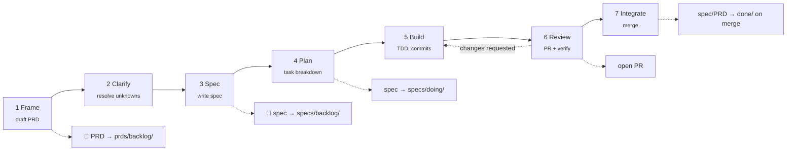

# lean-sdd-kit

**A lean, agent-native template for Spec-Driven Development.**
Start a new project fast, build autonomously, and keep everything documented — with status tracked by *where a document lives*, not by a tool.

[](./LICENSE)
[](./WORKFLOW.md)

---

## What is this?

`lean-sdd-kit` is a **copy-and-go repository skeleton** for building software with an AI coding agent (Claude Code, Cursor, Copilot, …) as a first-class collaborator. It gives you four documented artifacts and one rule:

> **The directory a document lives in *is* its status.** `backlog/ → doing/ → done/`. Move it with `git mv`. No status field, nothing to keep in sync.

It is intentionally minimal — designed for **1–3 person teams** and **monorepos** — and stack-agnostic. There is no CLI to install and no runtime dependency: it is Markdown, a couple of optional shell helpers, and a workflow.

## Why this method?

"Vibe coding" — prompting an agent and hoping — breaks down the moment a task is non-trivial. The agent loses intent, contradicts earlier decisions, and you can't tell what's done. **Spec-Driven Development (SDD)** fixes this by making *intent* the durable artifact: you write down the *why* and *what* before the *how*, and the agent executes against a spec it can't drift away from.

This kit takes the parts of SDD that pay off for a small team and drops the ceremony:

| Principle | Why it matters |
|---|---|
| **Intent is written before code** | The agent has a contract to satisfy → 3–10× higher first-pass success on real tasks. |
| **Specs persist (they're not throwaway)** | When code and spec live together, the next change — by you or the agent — starts from truth, not archaeology. |
| **Status = directory** | A 3-person team should see all work-in-progress with one `ls`, not a Jira board. |
| **Specs are agent-executable** | Each spec ends in *tasks → acceptance criteria → verification commands*, so an agent can build and self-check. |
| **Decisions are an append-only log (ADRs)** | You never wonder "why did we choose X?" six weeks later. |

See [`WORKFLOW.md`](./WORKFLOW.md) for the full loop and how it compares to spec-kit, Kiro, BMAD, OpenSpec and Tessl.

## The four artifacts

| Doc | Question it answers | Lives in | Flows through states? |
|---|---|---|---|
| **PRD** | *Why* and *what* — the intent of an initiative | `docs/prds/<state>/` | ✅ yes |
| **Spec** | *How* — the agent-executable plan of work | `docs/specs/<state>/` | ✅ yes |
| **ADR** | *Why we chose X* — an architectural decision | `docs/adr/` | ❌ append-only log |
| **CLAUDE.md** | The standing rules of the repo (principles, commands, conventions) | repo root | n/a (living) |

> A small feature can be **just a spec** (its header carries the lightweight "why"). A larger initiative gets a **PRD + one or more specs**.

## The workflow at a glance



Full version, with every document-creation and git event, in [`WORKFLOW.md`](./WORKFLOW.md).

## Quickstart — start a new project

```bash
# 1. Copy the skeleton into your new repo (no fork/history needed)
npx degit RuBiCK/lean-sdd-kit my-project   # or: git clone … && rm -rf .git && git init
cd my-project

# 2. Write your project charter — this is PRD-0001
cp docs/prds/_TEMPLATE.md docs/prds/doing/0001-project-charter.md
$EDITOR docs/prds/doing/0001-project-charter.md   # problem, users, goals, scope, non-goals

# 3. Make the rules yours
$EDITOR CLAUDE.md           # fill in Principles + build/test/lint/run commands

# 4. Record your first real decision (e.g. the stack)
cp docs/adr/_TEMPLATE.md docs/adr/0003-choose-stack.md

# 5. Write the first slice of work as a spec, then hand it to your agent
cp docs/specs/_TEMPLATE.md docs/specs/backlog/0001-bootstrap-app.md
```

Then open your agent and say: *"Read CLAUDE.md and WORKFLOW.md, pick up `docs/specs/backlog/0001-bootstrap-app.md`, and build it."*

> Prefer a helper? `./scripts/new.sh spec bootstrap-app` creates the next-numbered spec from the template in `backlog/` for you. See [`scripts/`](./scripts).

## Quickstart — add a feature to an existing project

```bash
./scripts/new.sh spec export-csv        # → docs/specs/backlog/000N-export-csv.md
# (optional) for a multi-spec initiative, also: ./scripts/new.sh prd billing
$EDITOR docs/specs/backlog/000N-export-csv.md
```

Fill *Context & Goal → Tasks → Acceptance criteria → Verification*, then run the loop.

## Repository layout

```
lean-sdd-kit/
├── README.md                 # you are here
├── LICENSE                   # MIT
├── CLAUDE.md                 # agent operating guide: principles, commands, conventions
├── WORKFLOW.md               # the full agentic loop + diagrams + skills appendix
├── scripts/
│   └── new.sh                # optional: scaffold next-numbered prd/spec/adr
└── docs/
    ├── prds/
    │   ├── _TEMPLATE.md
    │   ├── backlog/  doing/  done/
    ├── specs/
    │   ├── _TEMPLATE.md
    │   ├── backlog/  doing/  done/
    └── adr/
        ├── _TEMPLATE.md
        ├── 0001-record-architecture-decisions.md
        └── 0002-directory-based-status.md
```

## Status model — kanban in your filesystem

Every PRD and spec carries a **permanent zero-padded ID** (`PRD-0001`, `SPEC-0002`). The number never changes; only the folder does.

```bash
git mv docs/specs/backlog/0002-auth.md docs/specs/doing/   # start work
git mv docs/specs/doing/0002-auth.md   docs/specs/done/     # ship it
```

- `backlog/` — specced and ready, not started
- `doing/`  — in progress (keep **WIP ≤ 2** for a small team)
- `done/`   — merged / shipped

`ls docs/specs/doing/` is your standup. No board, no drift.

## Monorepo orientation

This kit assumes a **single `docs/` kanban at the repo root** for the whole monorepo, so you see all work-in-progress across every package at once. Specs declare which packages they touch in their frontmatter:

```yaml
packages: [apps/web, packages/api]
```

Cross-cutting decisions are repo-wide ADRs; package-local conventions can be noted in a per-package `CLAUDE.md` that defers to the root one. See [`WORKFLOW.md`](./WORKFLOW.md#monorepo-notes).

## Using it with AI agents

Point your agent at `CLAUDE.md` and `WORKFLOW.md` at the start of a session. The specs are written *for* an agent: tasks are bite-sized, acceptance criteria are checkboxes, and every spec ends with the exact commands to verify the work. The appendix in `WORKFLOW.md` maps each phase to concrete skills/commands (e.g. brainstorming → writing-plans → TDD → code-review).

## Credits & inspiration

Stands on the shoulders of [GitHub spec-kit](https://github.com/github/spec-kit), AWS Kiro, [BMAD-METHOD](https://github.com/bmad-code-org/BMAD-METHOD), OpenSpec, and Tessl. The distinctive bet here is *directory-as-status* + *lean enough for 1–3 people* + *monorepo-first*.

## License

[MIT](./LICENSE) — take it, fork it, ship it, do whatever you want.
