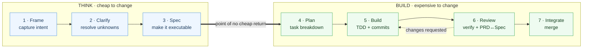
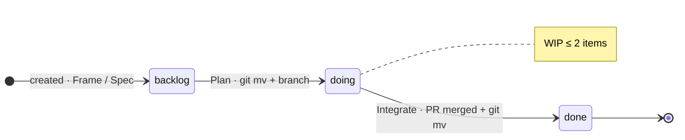
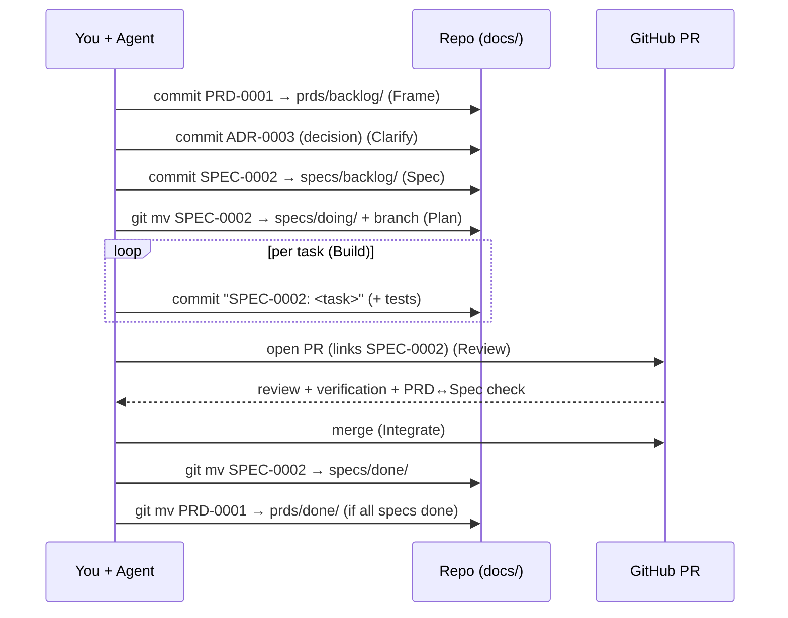

# WORKFLOW.md — the agentic loop

This is the full lifecycle: **which document is created at each step, when you commit or open a PR, and how documents move between states.** The phases are tool-neutral; the appendix maps them to concrete skills/commands.

> **TL;DR:** Frame → Clarify → Spec → Plan → Build → Review → Integrate.
> A document is *born* in `backlog/`, *lives* in `doing/`, and *retires* to `done/`. Each transition is a `git mv` in a commit.

---

## The seven phases

The line between **THINK** and **BUILD** is the point of no cheap return: changing a spec costs minutes, changing shipped code costs hours. Spend your effort on the left.

---

## What happens in each phase

| # | Phase | Document action | Git action |
|---|---|---|---|
| 1 | **Frame** | *Initiative?* create a **PRD** in `docs/prds/backlog/`. *Small feature?* skip straight to a spec. | `git add` + commit the PRD (or nothing yet). |
| 2 | **Clarify** | Resolve open questions on the PRD/spec. Record any decision as an **ADR** in `docs/adr/`. Decompose if it's really several specs. | Commit the ADR(s) and PRD edits. |
| 3 | **Spec** | Create the **spec** in `docs/specs/backlog/` (Context & Goal → Tasks → Acceptance → Verification). Link it to its PRD; PRD lists the spec. | Commit the spec. PRD → `doing/` once work is committed. |
| 4 | **Plan** | Expand the spec's **Tasks** into a bite-sized, ordered checklist. No new doc — the spec *is* the plan. | `git mv` spec `backlog/ → doing/`. Cut branch `spec/NNNN-slug`. |
| 5 | **Build** | Implement task by task, test-first. Tick tasks in the spec as you go. | **Commit per task**: `SPEC-NNNN: <task>`. |
| 6 | **Review** | Open a **PR**. Run the spec's **Verification** commands. Check each acceptance criterion. **Confirm the result still satisfies the PRD** (coherence check). | Open PR; push review fixes as commits. |
| 7 | **Integrate** | Merge. | Squash/merge PR. `git mv` spec `doing/ → done/`. If all of a PRD's specs are `done/`, move the **PRD → done/** too. |

---

## Document lifecycle (where status lives)

A document's file path is its state: `docs/specs/backlog/` → `…/doing/` → `…/done/` (same for `prds/`).

ADRs do **not** flow — they are an append-only decision log. Supersede an old ADR with a new one; never delete.

---

## The git events, end to end

---

## New project vs. new feature

**New project** — you're establishing the foundation:
1. **Frame:** write `PRD-0001` = the *project charter* (problem, users, goals, scope, non-goals). It starts in `doing/`.
2. **Clarify:** fill the **Principles** in `CLAUDE.md`; record the stack and other foundational choices as ADRs.
3. **Spec:** write the first specs for the v1 build (`0001-bootstrap-app`, …).
4. Run the build loop per spec.

**New feature** — you're operating inside an established project:
1. **Frame:** if it spans multiple specs, write a PRD; otherwise go straight to a spec (its header carries the "why").
2. **Spec → Plan → Build → Review → Integrate** as above.

---

## Monorepo notes

- **One root `docs/` kanban** for the whole monorepo — `ls docs/specs/doing/` shows all WIP across every package.
- A spec names the packages it touches in frontmatter: `packages: [apps/web, packages/api]`. Use this to scope tests/builds (`pnpm --filter apps/web test`).
- **Cross-cutting decisions** → root ADRs. Package-local conventions → an optional per-package `CLAUDE.md` that defers to the root one.
- One branch per spec (`spec/NNNN-slug`) even if it touches several packages — the spec is the unit of work, not the package.

---

## How this compares

| | spec-kit | Kiro | BMAD | OpenSpec | Tessl | **lean-sdd-kit** |
|---|---|---|---|---|---|---|
| Weight | light | medium (IDE) | heavy (12–21 agents) | light | medium | **light** |
| Specs persist? | discarded | discarded | persist | persist (delta) | are the source | **persist** |
| Status tracking | none | IDE | files | delta files | spec registry | **directory = status** |
| Stack-agnostic | yes | no (IDE) | yes | yes | no (framework) | **yes** |
| Sweet spot | greenfield | interactive | enterprise | brownfield edits | regeneration | **1–3 people, monorepo** |

We borrow spec-kit's *constitution* (→ Principles in `CLAUDE.md`), its explicit *clarify* phase, and its *cross-artifact analyze* (→ the PRD↔Spec coherence check in Review) — without the per-feature subfolders or multi-agent overhead.

---

## Appendix — phase → skills / agents

### Kit-native (Claude Code adapter, `.claude/`)

The kit ships skills and subagents that travel with it. They orchestrate the loop directly:

| Phase | Skill | Subagent it dispatches |
|---|---|---|
| Setup (new project) | `sdd-setup` (interview → `STACK.md`, charter, ADR) | — |
| Frame · Clarify · Spec | `sdd-new` | `spec-writer` |
| Plan · Build · Review · Integrate | `sdd-build` | `builder` (test-first), then read-only `reviewer` |

`sdd-build` runs `builder` and `reviewer` in **separate, tool-scoped contexts** — the reviewer is read-only so it can't make its own work pass. This is the "fine-tune each task" idea: one agent per role.

### Generic mapping

If you use [Claude Code Superpowers](https://github.com/obra/superpowers) (or similar) instead, map the phases like so:

| Phase | Skill / command |
|---|---|
| Frame + Clarify | `brainstorming` (one question at a time → approved design) |
| Spec | `brainstorming` design doc → the spec template here |
| Plan | `writing-plans` (bite-sized tasks) |
| Build | `test-driven-development` (red → green → refactor), `executing-plans` |
| Review | `requesting-code-review`, `/code-review`, `verification-before-completion` |
| Integrate | `finishing-a-development-branch` |

No skills? The phases stand on their own — just follow the table in *What happens in each phase*.
